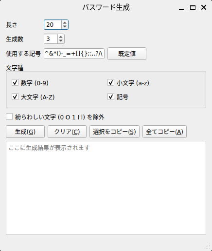

# password-generator-gui

PySide6 + Qt Designer（`.ui`）で作る、パスワード生成 GUI ツールです。  
パスワード生成ロジックは既存の CLI 実装を流用しています。

## 概要
- 長さ・生成数・文字種（数字/小文字/大文字/記号）を指定してパスワードを生成します
- 「紛らわしい文字（0 O 1 I l）を除外」オプションに対応します
- サイト/サービスの制約に合わせるため、使用する記号セットを入力できます
- 生成結果は選択コピー/全コピーができます
- 前回の設定は `QSettings` で保存・復元されます

## 必要環境
- Python 3.13+
- [uv](https://docs.astral.sh/uv/)（推奨）

Linux で日本語が「□」になる場合は、日本語フォントが不足している可能性があります。  
（例: Ubuntu/Debian）:
```bash
sudo apt-get install fonts-noto-cjk
```

## セットアップ方法
```bash
cd samples/password-generator-gui
uv sync
```

## 起動方法
```bash
cd samples/password-generator-gui
uv run python -m password_gui
```

## 利用方法（画面の説明）

### 画面イメージ



### 入力エリア
- **長さ**: 生成するパスワードの長さ（4〜128）
- **生成数**: 生成する件数（1〜50）
- **使用する記号**: 「記号」を ON にしているときに使う記号セット
  - 例: `-_.@` のように、許可したい記号だけを入力します
  - **既定値**ボタンで既定の記号セットへ戻します
- **文字種**
  - **数字 (0-9)** / **小文字 (a-z)** / **大文字 (A-Z)** / **記号**
  - ON にした文字種を必ず最低 1 文字ずつ含むように生成します
- **紛らわしい文字 (0 O 1 I l) を除外**
  - ON の場合、候補から `0 O 1 I l` を除外します

### ボタン
- **生成**: 指定条件でパスワードを生成し、結果エリアに 1 行 1 件で表示します
- **クリア**: 結果エリアを空にします
- **選択をコピー**: 結果エリアで選択した範囲をコピーします（未選択ならメッセージ表示）
- **全てコピー**: 結果エリア全文をコピーします（空ならメッセージ表示）

## テスト
```bash
cd samples/password-generator-gui
uv run --group test pytest
```

## ディレクトリ構成
```
samples/password-generator-gui/
  AGENTS.md
  PLANS.md
  README.md
  pyproject.toml
  resources/
    ui/
      main_window.ui        # Qt Designer の UI（XML）
  src/
    password_gui/
      __init__.py
      __main__.py           # python -m password_gui
      main_window.py        # GUI層（.ui 読み込み + イベント）
      generator.py          # ロジック層（CLI 実装流用）
  tests/
    conftest.py
    test_generator.py
```

## 参照元（CLI 実装）
- `samples/password-generator-cli/password_gen.py`
- https://github.com/ojichiku/public-python-samples/blob/main/samples/password-generator-cli/password_gen.py

## Nuitka でのビルド（メモ）
`.ui`（`resources/ui/main_window.ui`）は外部ファイルとして同梱してください。  
（例: `--include-data-file` を使って同梱）

※ ビルドコマンドは環境/方針で変わるため、ここでは「.ui を同梱する」点のみを必須事項として記載します。

## ライセンス
MIT License
